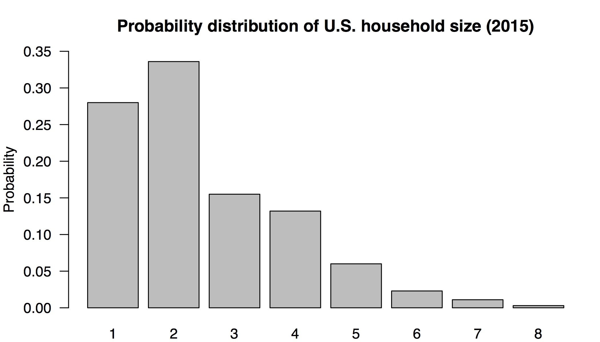
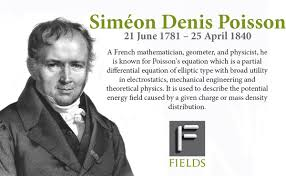

Discrete random variables  
===================
date: James Scott (UT-Austin)
autosize: true
font-family: 'Gill Sans'
transition: none

Reference: Bertsekas Chapter 2 (except 2.6)  

Outline
=====

-	Random variables  
- Probability mass functions  
-	Expectation and variance 
- New random variables from old ones
- Parametric models 
 

***

- The Poisson distribution  
- Independence of random variables  
- The Bernoulli and binomial distributions  
- Joint PMFs  
- Linear combinations of random variables  

Random variables  
=========

Suppose we have an uncertain outcome with sample space $\Omega$.  

A _random variable_ $X$ is a real-valued function of the uncertain outcome.  That is, it maps each element $\omega \in \Omega$ to a real number.  

Simple mantra: a random variable is a numerical summary of some uncertain outcome.  

Example 1: rolling two dice  
========

Suppose you roll two dice (an uncertain outcome).  An example of a random variable is the maximum of the two rolls:

Example 2: airline no shows
========

Suppose you're trying to predict the number of no-shows on a flight:  
- The sample space $\Omega$ is all possible combinations of seats.  
- Each $\omega \in \Omega$ is some particular combination of seats that could no-show, e.g. "2A, 13C, 17F"  
- The random variable $X(\omega)$ is the _size_ of $\omega$: that is, how many seats no-showed.

Example 2: airline no shows
========

- $\omega$ = 7F, 16E, 21A
- $X(\omega) = 3$  

Example 2: airline no shows
========

- $\omega$ = 3C, 9D, 14B, 19C, 24F
- $X(\omega) = 5$  

Example 2: airline no shows
========

- $\omega$ = 12F, 15C, 18C, 20B, 26F
- $X(\omega) = 5$  

Note: different $\omega$'s can map to the same number.   

Random variables: big-picture  
=======

Starting with some random outcome with sample space $\Omega$:  
- A random variable is a real-valued function (i.e. numerical summary) of the outcome $\omega$.  
- We describe the behavior of a random variable in terms of its _probability distribution_ $P$: a set of possible outcomes for the random variable, together with their probabilities.   
- We can associate with each random variable certain "averages" or "moments" of interest (e.g. mean, variance).  
- A function of a random variable defines another random variable.  

Discrete random variables  
=======

A random variable is _discrete_ if its range, i.e. the set of values it can take, is a finite or countably infinite set.  

Both our examples (dice, airline no-shows) were discrete random variables: you can count the outcomes on your fingers and toes.  Something that can take on a continuous range of values (e.g. temperature, speed) is called a _continuous_ random variable.  

For now, we will focus exclusively on discrete random variables.  (The math and notation for continuous random variables is more fiddly, but the concepts are the same.)  

Probability mass function  
=======

Suppose that $X$ is a discrete random variable whose possible outcomes are some set $\mathcal{X}$.  Then the probability mass function of $X$ is 

$$
p_X(x) = P(\{X = x\})  
$$

We always use $X$ for the random variable, and $x$ for some possible outcome.  

Facts about PMFs:
- $0 \leq p_X(x) \leq 1$  
- $\sum_{x \in \mathcal{X}} p_X(x) = 1$  
- For any set of numbers $S$, $P(\{ X \in S \}) = \sum_{x \in \mathcal{S}} p_X(x)$

Probability mass functions: an example  
=======

Dan, my friend from grad school, has just pulled up to his new house after a long cross country drive.    

But he discovers that the movers have buggered off and left all his furniture and boxes sitting in the front yard. What a mess!  

He decides to ask his new neighbors for some help getting his stuff indoors.

Assuming his neighbors are the kindly type, how many pairs of hands might come to his aid?   

Probability mass functions: an example  
=======
right: 60%

Let's use a capital $X$ to denote the (unknown) size of the household next door.  

We'll let little $x$ be some specific possible outcome.  

Table: a probability mass function $p_X(x)$, taken from census data.  

***

| Size of household x | Probability, P(X = x)  |  
|---|-------|  
| 1 | 0.280 |  
| 2 | 0.336 |  
| 3 | 0.155 |  
| 4 | 0.132 |  
| 5 | 0.060 |  
| 6 | 0.023  |  
| 7 | 0.011  |  
| 8 | 0.003 |  

Probability mass functions: an example  
=======

This is easier to visualize in a bar graph:  

Probability mass functions: an example  
=======

This probability mass function provides a complete representation of your uncertainty in this situation.  It has all the key features of any probability distribution:   
- An uncertain outcome: the composition of the family next door.  
- A numerical function of that uncertain outcome: how large the family is.   
- Finally, there are probabilities for each possible value of the random variable (here provided in a look-up table or bar graph).  

Most probability distributions won't be this simple, but they all have these same three features.  

Expected value
=======

When you knock on the door, how many people do you "expect" to be living next door?  

Expected value
=======

The _expected value_ or _expectation_ of a random variable $X$ is the __weighted average of the possible outcomes__, where the weight on each outcome is its probability.  

| Size x | 1 | 2 | 3 | 4 | 5 | 6 | 7 | 8 |
| --- | --- | --- | --- | --- | --- | --- | --- | --- | 
| Probability, P(X = x) | 0.280 | 0.336 | 0.155 | 0.132 | 0.060 | 0.023 | 0.011  | 0.003 |   

<small>
$$
E(X) = (0.280) \cdot 1 + (0.336) \cdot 2 + \cdots + (0.011) \cdot 7 +  (0.003) \cdot 8 \approx 2.5 \, .
$$
</small>

The more likely numbers (e.g. 1 and 2) get higher weights than $1/8$, while the unlikely numbers (e.g. 7 and 8) get lower weights.

Expected value
=======

This differs from the ordinary average!  For our family-size example this would be:  

$$
\mbox{Ordinary average} = \frac{1}{8} \cdot 1 + \frac{1}{8} \cdot 2 + \cdots + \frac{1}{8} \cdot 7 + \frac{1}{8} \cdot 8 = 4.5 \, .
$$

Here, the weight on each number in the sample space is $1/8 = 0.125$, since there are 8 numbers.

This is _not_ the expected value; it give each number in the sample space an equal weight, ignoring the fact that these numbers have different probabilities.  

Expected value
=======

This example conveys something important about expected values.  Even if the world is black and white, an expected value is often grey:  
- the "expected" American household size is 2.5 people   
- a baseball player "expects"" to get 0.25 hits per at bat  
- you "expect" to get 0.5 heads per coin flip.  
- you "expect" that your newborn child will have one 0.485 ovaries (since 100/206 newborns are female).      

Even if the underlying outcomes are all whole numbers, the expected value doesn't have to be.  

Expected value: definition  
=======

Suppose that the possible outcomes for a random variable $X$ are the numbers $x_1, \ldots, x_N$ with probabilities $P(X = x_i)$.  

The formal definition for the expected value of $X$ is

$$
E(X) = \sum_{i=1}^N P(X = x_i) \cdot x_i = \sum_{x \in \mathcal{X}} p_X(x) \cdot x \, .
$$

This measures the "center" or mean of the probability distribution.  

Expected value: definition  
=======

A nice interpretation here is that the expectation is like the "center of gravity" of a probability distribution.  Arrange each outcome $x_i$ along the real line, and place a mass equal to $P(X = x_i)$ at each point.  The expected value is the center of gravity, i.e. where the masses would balance like on a see-saw:  

An aside: long-run averages
=======

You may have heard the expected value explained intuitively in terms of a _limiting long-run average_:  

Three simulated long-run sequences of coin flips.  

An aside: long-run averages
=======

It goes kinda like this:  

> Suppose we were to observe a large number of random variables with the same probability distribution $P$.  The expected value of $P$ is the limiting long-run average of the observed outcomes.  

This is 100% true! _But it is not the definition of the expected value._   
- Rather, it follows from a really cool theorem called the __Law of Large Numbers__.    
- We'll prove this theorem soon: for something so deep, it's surprisingly easy!    

Variance: definition  
=======

A related concept is the _variance_, which measures the dispersion or spread of a probability distribution.

It is the _expected (squared) deviation of a random variable from its mean_:  

$$
\mbox{var}(X) = E \big( \{X-E(X)\}^2 \big)  
$$

The standard deviation of a probability distribution is $\sigma = \mbox{sd}(X) = \sqrt{\mbox{var}(X)}$. The standard deviation is more interpretable than the variance, because it has the same units (dollars, miles, etc.) as the random variable itself.

Calculating the variance "by hand"  
=======

Again suppose that there are $N$ possible outcome $x_1, x_2, \ldots, x_N$.  Then by just applying the definition of expected value, we see that:  

$$
\begin{aligned}
\mbox{var}(X) &= E \big( \{X-E(X)\}^2 \big) \\
&= \sum_{i=1}^N P(X = x_i) \cdot (x_i - \mu)^2  
\end{aligned}
$$

where $\mu = E(X)$ is the expected value of the random variable.   

Variance: toy example    
=======
type: prompt

Your turn: try calculating the variance for our family-size random variable:

| Size x | 1 | 2 | 3 | 4 | 5 | 6 | 7 | 8 |
| --- | --- | --- | --- | --- | --- | --- | --- | --- | 
| Probability, P(X = x) | 0.280 | 0.336 | 0.155 | 0.132 | 0.060 | 0.023 | 0.011  | 0.003 |   

Tips:  
- Remember we already calculated the expected value as $\mu \approx 2.5$.    
- This can be done reasonably painlessly in a small spreadsheet (Excel, Google Sheets, etc).  

This might be the only time in your life you calculate a variance explicitly by hand!  

Variance: toy example    
=======

[Here's a Google Sheet where I've worked it out.](https://docs.google.com/spreadsheets/d/1QO2xyxC1GPTU7plHto0r0A7HW-reNtRBW80ZfIB-DJQ/edit?usp=sharing)  

I get:  
- a variance of about 2.02 "squared persons"... (?) 
- and thus a standard deviation of about 1.42 persons.  

New random variables from old ones  
=====

Suppose $X$ is a random variable.  We can define a new random variable $Y = g(X)$.  For example:  
- Let $X$ be tomorrow's high temperature in degrees Celsius  Then $Y = 1.8X + 32$ is tomorrow's high in degrees Fahrenheit.  
- Let $X$ be your average speed in MPH on your 5-mile commute tomorrow.  Then $Y = 60 \cdot 5/X$ is the time in minutes it will take you to get to work.  
- Let $X$ be the diameter of a well bore manufactured by a drilling company.  Then $Y = \pi \cdot (X/2)^2$ is the cross-sectional area of the drill.  

New random variables from old ones  
=====

If $Y = g(X)$, then the PMF of $Y$ can be obtained directly from the PMF of $X$: 

$$
p_Y(y) = \sum_{x: g(x) = y} p_X(x)  
$$

In words: to obtain $p_Y(y)$ we add the probabilities of all values of $x$ such that $g(x) = y$.  

New random variables from old ones  
=====

For linear functions, the rules for expectation and variance are easy.  Suppose that $X$ is some random variable, and that $Y = aX + b$ for constants $a$ and $b$.

Then

$$
\begin{aligned}
E(Y) &= E(aX + b) = a E(X) + b \quad \mbox{(Linearity of expectation)} \\
\mbox{var}(Y) &= a^2 \ \mbox{var}(X) \\
\mbox{sd}(Y) &= |a| \ \mbox{sd}(X)
\end{aligned}  
$$

Let's prove this on the board using the linearity of expectation.    

New random variables from old ones  
=====

For nonlinear functions, things are not as nice.  Suppose $X$ has PMF $p_X(x)$, and let $Y = g(X)$.  Then to calculate $E(Y)$, we have to go back to the PMF:   

$$
E(Y) = E(g(x)) = \sum_{x} g(x) p_X(x)  
$$

In words: the expectation of $g(X)$ is the weighted average outcome for $g(X)$, weighted by the probabilities.  

A useful identity
=====

A useful identity for the variance of a random variable is

$$
\begin{aligned}
\mbox{var}(X) &= E \big( \{X-E(X)\}^2 \big)  \\
& = E(X^2) - E(X)^2\, .
\end{aligned}  
$$

Building probability models     
=======

A probability model is a stylized description of a real-world system in terms of random variables.  To build one:  
  1. Identify the uncertain outcome of interest (e.g. a soccer game between Arsenal and Manchester United) and corresponding sample space $\Omega$ (e.g. all possible soccer scores).  
  2. Identify the _random variables_ associated with that uncertain outcome, e.g. $X_A$ = the number of goals scored by Arsenal, and $X_M$ = the number of goals scored by Man U.  (Remember: a random variable is just a numerical summary of an uncertain outcome.)  
  3.  Finally, specify a probability distribution that lets us calculate probabilities associated with each random variable.    

Building probability models     
=======

Step 3---specify a probability distribution for the random variable(s) of interest---is usually the hardest one.  

In fact, for most scenarios, if we had to build such a rule from scratch, we'd be in for an awful lot of careful, tedious work.  Imagine trying to list, one by one, the probabilities for all possible outcomes of a soccer game.  

Thus instead of building probability distributions from scratch, we will rely on a simplification called a _parametric probability model._

Parametric models     
=======

A _parametric probability distribution_, or parametric model, is a probability distribution that can be completely described using a relatively small set of numbers.

These numbers are called the _parameters_ of the distribution.  

_Lots_ of parametric models have been invented for specific purposes:  
- normal, binomial, Poisson, $t$, chi-squared, Weibull, etc
- A large part of getting better at probability modeling is to learn about these existing parametric models: what they are, and when they're appropriate.  

Parametric models   
=======

Suppose $X$ is a discrete random variable with possible outcomes $x \in \mathcal{X}$.  In a parametric model, the PMF of $X$ takes the form

$$
P(X = x) = f(x;  \theta) \, 
$$

where $\theta$ is the parameter (or parameters) of the model.  

__The parameter $\theta$ completely specifies the PMF.__ Contrast this with the family-size example, where we had to write out the PMF explicitly for each possible outcome.  

The Poisson distribution  
=======

This is all pretty abstract!  Let's see a specific example: the __Poisson distribution.__ 

The Poisson distribution  
=======

This is all pretty abstract!  Let's see a specific example: the __Poisson distribution.__ 

(Not that Poisson...)  

The Poisson distribution  
=======

This is all pretty abstract!  Let's see a specific example: the __Poisson distribution.__ 

(That Poisson!)   

The Poisson distribution  
=======

The Poisson distribution models the number of "events" that occur in a pre-specified interval (e.g. time or space):    
- How many goals will Arsenal score in their game against Man U? (Event = goal, interval = 90-minute game)   
- How many couples will arrive for dinner at a hip new restaurant between 7 and 8 PM on a Friday night?  (Event = arrival of a couple, interval = one hour)   
- How many irate customers will call AT&T customer service in the next minute?  (Event = phone call, interval = one minute)  
- How many potholes will you encounter on a randomly chosen one-mile strip of I-35? (Event = pothole, interval = one mile)    

The Poisson distribution  
=======

For each uncertain outcome, we identify the random variable $X$ as the total number of events that occur in the given interval.   The Poisson distribution assumes that:  
- Independence: events occur independently.  Seeing one event neither increases nor decreases the probability that a subsequent event will occur.  (E.g. no "hot hand" for goal scoring.)  
- Homogeneity: events occur the same average rate throughout the interval.  That is, there is no sub-interval where events are more likely to happen than in other sub-intervals. (E.g. if the probability that Arsenal scores in a given 1-minute stretch of the game is 2%, then the probability they score during _any_ 1-minute stretch is 2%.)  

The Poisson distribution  
=======

- The possible outcomes of a Poisson random variable are the non-negative integers, $k = 0, 1, 2, \ldots$
- The Poisson distribution is parametrized by a _rate_, conventionally denoted $\lambda$.  (E.g. 2.1 goals per game, 3.4 potholes per mile, etc.)  
- The PMF of Poisson distribution takes the following form:

$$
P(X = k) = \frac{\lambda^k}{k!} e^{-\lambda} \, ,
$$

- The expected value of a Poisson random variable is the rate $\lambda$.  
- The variance of a Poisson random variable is also the rate $\lambda$.  (That's not a typo.)  

Example: Arsenal vs. Man U  
=======

Example: Arsenal vs. Man U  
=======

Suppose that Arsenal averages 1.6 goals per game, while Manchester United averages 1.3 goals per game.  
- How likely is it that Arsenal scores 1 goal?  
- How likely is it that Arsenal beats Man U by a score of 2-1?  
- How likely is it that the teams will combine for 5 or more goals?  

To answer these questions, _we need a probability model_.  Let's try Poisson!    

Example: Arsenal vs. Man U  
=======

Let $X_{A}$ be the number of Arsenal goals.  
- Assume that $X_A$ can be a described by a Poisson distribution with rate parameter $1.6$.
- We write this as $X_A \sim \mbox{Poisson}(\lambda_A = 1.6)$.  

Similarly, $X_{M}$ be the number of Man U goals.  
- Assume that $X_M$ is Poisson with rate parameter $1.3$.  
- $X_M \sim \mbox{Poisson}(\lambda_M = 1.3)$.  

Our model sets the rate parameters for each team's Poisson distribution to match their average scoring rates across the season.  

Example: Arsenal vs. Man U  
=======

What is $P(X_A = 1)$?  Remember that if $X \sim$ Poisson($\lambda$), then  

$$
P(X = k) = \frac{\lambda^k}{k!} e^{-\lambda}
$$

So

$$
P(X_A = 1) = \frac{1.6^1}{1!} e^{-1.6} \approx 0.323  
$$

Example: Arsenal vs. Man U  
=======
type: prompt

What is $P(X_M = 3)$?  You try!

$$
P(X = k) = \frac{\lambda^k}{k!} e^{-\lambda}
$$

Example: Arsenal vs. Man U  
=======

What is $P(X_M = 3)$?  You try!

$$
P(X = k) = \frac{\lambda^k}{k!} e^{-\lambda}
$$

I get

$$
P(X_M = 3) = \frac{1.3^3}{3!} e^{-1.3} \approx 0.1  
$$

Independence of random variables
======

Suppose that $X$ and $Y$ are two discrete random variables.  We say that $X$ and $Y$ are independent if

$$
P(X=x, Y=y) = P(X=x) \cdot P(Y=y)
$$

for all possible outcomes $x$ and $y$.  

All we're saying here is that the events $\{X=x\}$ and $\{Y=y\}$ are independent events.  

Just as before, independence is often something we assume to make the math simpler.  

Back to Arsenal vs. Man U  
=======

How likely is it that Arsenal beats Man U by a score of 2-1?  

For this, we need another assumption.  Let's say that $X_A$ and $X_M$ are independent random variables: that is,

$$
P(X_A = j, X_M = k) = P(X_A = j) \cdot P(X_M = k)
$$

for all $j, k$.

Basically, we're saying that Arsenal's score doesn't affect Man U's score, and vice versa.  (This assumption might not be exactly true, but doesn't seem crazy.)  

Back to Arsenal vs. Man U  
=======

We need $P(X_A = 2, X_M = 1)$, where $X_A \sim$ Poisson(1.6) and $X_M \sim$ Poisson(1.3). 

Under independence, we know that

$$
\begin{aligned}
P(X_A = 2, X_M = 1) &= P(X_A = 2) \cdot P(X_M = 1) \\
&= \left[ \frac{1.6^2}{2!} e^{-1.6} \right] \cdot \left[ \frac{1.3^1}{1!} e^{-1.3} \right] \\
&\approx 0.2584 \cdot 0.354 \\
& \approx 0.0916
\end{aligned}
$$

About a 9% chance of a 2-1 Arsenal victory.  

Example: Arsenal vs. Man U  
=======
type: prompt  

[Here's another Google Sheet where I've worked out all scores up to 8-8 under these assumptions.](https://docs.google.com/spreadsheets/d/1XrwtvC5J1RFWiBBY9Bt1EqP485ZYKGAgswtGSjpbxnQ/edit?usp=sharing)  

Your turn!  What is:  
- the probability that Man U beats Arsenal? (front 1/3 of the seats)  
- the probability of a draw (tie)?  (middle 1/3 of the seats)
- the probability that the teams will combine for 5 or more goals?  (back 1/3 of the seats)  

To modify this sheet, you can use "File > Make a Copy" or download my Google sheet as an Excel file.  

The Bernoulli distribution
=======

Our second example of a parametric probability model is the Bernoulli distribution.

It's really simple!  Imagine some uncertain outcome with only two possibilities:   
- a coin comes up heads or tails  
- a borrower defaults on the mortgage, or not  
- a patient in a cancer trial survives beyond 5 years, or not.  
- a voter intends to vote for the incumbent, or not.  

The Bernoulli distribution
=======

To define a Bernoulli random variable $B$ (or "Bernoulli trial"), we associate the number 0 with the "no" outcome, and the number 1 with the "yes" outcome:  
- a coin comes up heads (B=1) or tails (B=0).     
- a borrower defaults on the mortgage (B=1), or not (B=0).   
- a patient in a cancer trial survives beyond 5 years (B=1), or not (B=0).  
- a voter intends to vote for the incumbent (B=1) or not (B=0).  

In each case, we let $p$ denote the probability of the "yes" (1) outcome.  What counts as the "yes" outcome will be context dependent.  

The Bernoulli distribution
=======

The PMF of a Bernoulli random variable is pretty basic:   

$$
p_B(b) = 
\left\{
\begin{array}{rr}
p & \mbox{if b=1} \\
1-p & \mbox{if b=0}  \\
0 & \mbox{otherwise.}
\end{array}
\right.
$$

We write this as $B \sim \mbox{Bern}(p)$.  The only parameter is $p$: a number between 0 and 1.  

The Bernoulli distribution
=======

The mean and variance of a Bernoulli are:

$$
\begin{aligned}
E(B) &= 1 \cdot p + 0 \cdot (1-p) \\
&= p  \\
\\
\mbox{var}(B) &= E(B^2) - E(B)^2 \\
&= \left[1^2 \cdot p + 0^2 \cdot (1-p) \right] - p^2 \\
&= p - p^2 \\
&= p(1-p)  
\end{aligned}
$$

Pretty simple!  Bernoulli random variables are much more interesting when we combine them!    

The binomial distribution
=======

Our third example of a parametric probability model is the binomial distribution.

Suppose that we observe the results of $N$ Bernoulli random variables.    
- A coin is flipped ten times and it comes up heads (1) or tails (0) each time.    
- A mortgage lender like UFCU has 100,000 borrowers, each of whom defaults (1) or not (0) on their payments.  
- CNN conducts a poll of 1200 voters, asking each one whether they intend to vote for the incumbent (B=1) or not (B=0).  

We are interested in the total number of "yes" (1) outcomes.  

The binomial distribution
=======

The binomial distribution describes just this situation.  It has some pretty specific assumptions:

- We have a sequence of $N$ Bernoulli trials.  
- For each of the $N$ Bernoulli trials, the result is "yes" (1) with probability $p$ and "no" (0) with probability $1−p$.  __Each Bernoulli trial has the same probability of a 1.__
- Each Bernoulli trial is independent of the others.  

Let $X$ be the number of 1's in the N-trial sequence.  We say that $X$ has a binomial distribution with parameters $N$ and $p$: $X \sim \mbox{Binomial}(N, p)$.  

The binomial distribution
=======

Suppose $X \sim \mbox{Binomial}(N=2, p=0.5)$: a sequence of $N=2$ Bernoulli trials, with $p=0.5$.  (Like two coin flips.)  
- There are four possible sequences: 00, 01, 10, 11.
- Each sequence has probability $0.5 \times 0.5 = 0.25$.  
- Of these sequences, one has 0 heads, two have 1 head, and one has 2 heads.  
- So our PMF is: $p_X(0) = 0.25$, $p_X(1) = 0.5$, and $p_X(2) = 0.25$

The binomial distribution
=======

In general, the PMF of a binomial distribution looks like this:

$$
p_X(k) = \binom{N}{k} p^x (1-p)^{N-k} \; , \quad \binom{N}{k} = \frac{N!}{k! (N-k)!}
$$

$\binom{N}{k}$ is the binomial coefficient, read aloud as "N choose k."  Note that here we use k, instead of x, to denote the possible outcomes of an integer-valued random variable.  

The binomial distribution
=======

Where does this PMF come from?  __By counting.__  

- A sequence of Bernoulli(p) trials with $k$ yes outcomes has probability $p^k (1-p)^{N-k}$, since the trials are independent (compounding rule!)    
- But there are many possible sequences of $N$ Bernoulli trials can get you to $k$ "yes" outcomes.  (E.g. when $N = 4$, the sequences 0111, 1011, 1101, and 1110 all get you to $X = 3$.)
- So we have to count the number of binary sequences of length $N$ with exactly $k$ 1's in them.  

The binomial distribution
=======

If you count carefully, you find that there are

$$
\binom{N}{k} = \frac{N!}{k! (N-k)!}
$$

binary sequences of length $N$ with exactly $k$ 1's in them.  That's how we get the leading term in the binomial PMF.  

I won't bore you with the counting; [see Wikipedia](https://en.wikipedia.org/wiki/Binomial_coefficient#Combinatorics_and_statistics)  

Example: N = 4, k = 2
=======

1 1 0 0

1 0 1 0

0 1 1 0

1 0 0 1

0 1 0 1

0 0 1 1

Example: N = 6, k = 4
=======

1 1 1 1 0 0

1 1 1 0 1 0

1 1 0 1 1 0

1 0 1 1 1 0

0 1 1 1 1 0

1 1 1 0 0 1

1 1 0 1 0 1

1 0 1 1 0 1

***

0 1 1 1 0 1

1 1 0 0 1 1

1 0 1 0 1 1

0 1 1 0 1 1

1 0 0 1 1 1

0 1 0 1 1 1

0 0 1 1 1 1

Example: airline no-shows
=======

Let's use the binomial distribution as a probability model for our earlier example on airline no-shows.
- Say the airline sold tickets to 140 people, each of which will either show up to fly that day (1) or not (0).  
- Our random variable is $X =$ number of no shows
- Let's make two simplifying assumptions:
  1. Each person shows up independently of the other people.  
  2. The probability of any one person failing to show up is 9%, the industry average.  
  
Example: airline no-shows
=======

Under these assumptions, $X \sim$ Binomial(N=140, p=0.09), with PMF

$$
p_X(k) =  \binom{140}{k}  \ (0.09)^k \ (1-0.09)^{140-k} \, .
$$

Example: airline no-shows
=======
type: prompt

Your turn!  Suppose that:  
- The airline sold 140 tickets for 135 seats.  
- So if there are five no-shows, everyone gets a seat and the flight is full.  
- You don't have a ticket, but you are 7th on the standby list.  
- What is the probability of getting a seat under this model?

How would we calculate this probability?  

Example: airline no-shows
=======

To get a seat, you need 12 people to no-show (5 oversolds seats + 7 standby passengers).  To calculate $P(X \geq 12)$, we add up all the probabilities for $X=12$, $X=13$, $X=14$, all the way up to $X=140$.

This is called an "upper tail area" of the PMF. 

$$
P(X \geq 12) = \sum_{k=12}^{140} p_X(k) = \sum_{k=12}^{140} \binom{140}{k}  \ (0.09)^k \ (1-0.09)^{140-k}
$$

Example: airline no-shows
=======

You can eyeball it reasonably well from the graph of the PMF:

Example: airline no-shows
=======

You can eyeball it reasonably well from the graph of the PMF:

$$
P(X \geq 12) =  \sum_{k=12}^{140} p_X(k) \approx 0.613 
$$

Trade-offs of the model
=======

Real airlines use much more complicated models:
- Passengers on a late connecting flight will fail to show up together non-independently.  
- Business travelers are more likely no-shows than families.  

The binomial model cannot incorporate these (very real) effects.  This approximation _trades away flexibility for simplicity_:
- We don't need to specify the probability of all possible outcomes between 0 and 140.  
- We only have to specify two numbers: $N=140$ and $p=0.09$.    

Trade-offs of the model
=======

So to draw conclusions from a parametric probability model, we should ask two follow-up questions: 
  1. What simplifications have we made in building the model?  
  2. Have these assumptions made our model _too_ simple?  
  
This second answer will always be context dependent:  
- hard to provide general guidelines about what _too simple_ means.  
- Be mindful of what might go wrong if we use a simplified model, rather than invest  extra model-building work.   
- Similar to the trade-off that engineers face when they build simplified models of bridges, jets, etc.  

Joint PMFs
=======

Suppose that $X$ and $Y$ are two random variables associated with the same uncertain outcome.  Then joint PMF of $X$ and $Y$ is defined as

$$
p_{X,Y}(x,y) = P(X = x, Y = y)
$$

Now suppose $Z = g(X, Y)$.  Then  

$$
P_Z(z) = \sum_{(x, y): g(x,y) = z)} p_{X,Y}(x,y)  
$$

And 

$$
E(Z) = E(g(X,Y))= \sum_{x, y} g(x,y) p_{X,Y}(x,y) 
$$

Linear combinations of RVs   
====

In the special case where $g$ is linear and of the form $g(X,Y) = aX + bY + c$, where a, b, and c are given scalars, we have

$$
E(aX + bY + c) = aE(X) + bE(Y) + c  
$$

__The expectation of the sum is the sum of the expectations.__

Linear combinations of RVs 
====

These ideas extend naturally to the case of more than two random variables.  For example, suppose that $X_1, X_2, \ldots, X_N$ are all different random variables.  Define

$$
Z = a_1 X_1 + a_2 X_2 + \cdots a_N X_N = \sum_{i=1}^N a_i X_i \\
$$

Again, __the expectation of the sum is the sum of the expectations:__

$$
E(Z) = E \left( \sum_{i=1}^N a_i X_i \right) = \sum_{i=1}^N a_i E(X_i)
$$

Linear combinations of RVs 
====

There's an analogous rule for the variance: again, let

$$
Z = a_1 X_1 + a_2 X_2 + \cdots a_N X_N = \sum_{i=1}^N a_i X_i \\
$$

__If $X_i$ and $X_j$ are independent for all $i\neq j$,__ then:  

$$
\mbox{var}(Z) = \mbox{var} \left( \sum_{i=1}^N a_i X_i \right) = \sum_{i=1}^N a_i^2 \mbox{var}(X_i)
$$

The independence assumption is important.  If it's not true, we need a more complex formula (later).  

Example: the binomial
====

We can use these facts to calculate the mean and variance of the binomial.  

Imagine trying to calculate these directly from the definition.  Suppose $X \sim$ Binomial(N, p).  Then from the definition of expected value, we have:  

$$
\begin{aligned}
E(X) &= \sum_{k=1}^N k \cdot P(X = k) \\
 &= \sum_{k=1}^N k \cdot \binom{N}{k} p^k (1-p)^{N-k}  \, .
 \end{aligned}  
$$

What a giant algebra headache!  

Example: the binomial
====

Instead, we can use our cute results for the expected value and variance of a linear combination.  

We know that a binomial random variable is the number of 1's in a sequence of independent Bernoulli trials. So if $X \sim$ Binomial(N, p), then we can write $X$ as:

$$
X = B_1 + B_2 + B_3 + \cdots + B_N
$$

Example: the binomial
====

Now apply what we know:

$$
\begin{aligned}
E(X) &= E(B_1 + B_2 + B_3 + \cdots + B_N) \\
&= E(B_1) + E(B_2) + E(B_3) + \cdots + E(B_N) \\
&= p + p + p + \cdots + p \quad \mbox{(N times)}\\
&= Np
\end{aligned}
$$

Example: the binomial
====

Similarly, since each $B_i$ is independent of the others,  

$$
\begin{aligned}
\mbox{var}(X) &= \mbox{var}(B_1 + B_2 + B_3 + \cdots + B_N) \\
&= \mbox{var}(B_1) + \mbox{var}(B_2) + \mbox{var}(B_3) + \cdots + \mbox{var}(B_N) \\
&= p(1-p) + p(1-p) + p(1-p) + \cdots + p(1-p) \quad \mbox{(N times)}\\
&= Np(1-p)  
\end{aligned}
$$

So easy!  

