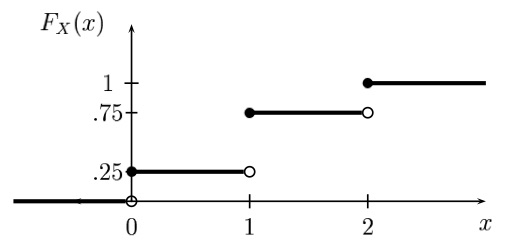

General random variables  
===================
date: James Scott (UT-Austin)
autosize: true
font-family: 'Gill Sans'
transition: none

Reference: Bertsekas Chapters 2.5-2.6, 3, 4.5, 4.7   

Outline
=====

- The CDF 
-	Continuous random variables and PDFs  
- the inverse CDF  
-	The normal distribution
- Moments for continuous random variables  

***

- Joint PMFs and PDFs
- Bivariate and multivariate distributions  
- Covariance and correlation  
- Conditional distributions 

The CDF 
=====

Up to now we've only been dealing with discrete random variables that are characterized by a PMF.  

But what about a random variable like:
- $X =$ Apple's stock price tomorrow?  
- $X =$ speed of the next pitch thrown by Justin Verlander?  
- $X =$ blood pressure of a randomly sampled participant in a clinical trial of a new drug?   

These outcomes cannot naturally be restricted to a finite or countable set, and they don't have PMFs.  To describe these random variables, we need some more general concepts.  

The CDF 
=====

The cumulative distribution function, or CDF, is defined as:  

$$
F_X(x) = P(X \leq x)
$$

Facts:  
- _All_ random variables have a CDF.  
- The CDF completely characterizes the random variable: if $X$ and $Y$ have the same CDF, then for all sets $S$, $P(X \in S) = P(Y \in S)$.  
- If this holds, we say that $X$ and $Y$ are _equal in distribution._  This doesn't mean they're identical!  It just means that all probability statements about $X$ and $Y$ will be identical.  

CDF: toy example
======

The CDF for Binomial(N=2, p=0.5).  (Let's write this on the board.) The jumps correspond to the points where the PMF has positive probability.  What is $F(1)$?  What is $F(0.6)?$  What is $F(17)$?  

Properties of CDFs
======

All CDFs $F(x)$ satisfy the following properties:  
  1. $F$ is non-decreasing: if $x_1 < x_2$, then $F(x_1) \leq F(x_2)$.  
  2. $F$ is bottoms out at 0 and tops out at 1: 
   - $\lim_{x \to -\infty} F(x) = 0$  
   - $\lim_{x \to \infty} F(x) = 1$  
  3. F is right-continuous, i.e.
  
  $$
  F(x) = \lim_{y \downarrow x} F(y)  
  $$
  
  Note: $\lim_{y \downarrow x}$ means "limit as $y$ approaches $x$ from above."

Continuous random variables  
======

Intuitively, a continuous random variable is one that has no "jumps" in its CDF.  More formally, we say that $X$ is a continuous random variable if there exists a function $f$ such that:  
  1. $f(x) \geq 0$  
  2. $\int_{\mathcal{R}}  f(x) dx =  \int_{-\infty}^\infty f(x) dx = 1$
  3. For every interval $S = (a,b)$,

$$
P(X \in S) = P(a \leq X \leq b) = \int_a^b f(x) \ dx
$$

Continuous random variables  
======

If $\delta$ is small, then $P(x < X < x + \delta) \approx f(x) \cdot \delta$.  

Example 1: uniform distribution on (0,2)
======

Suppose that $X$ is a random variable with PDF $f_X(x) = 1/2$ for $0 \leq x \leq 2$ (and $f(x) = 0$ otherwise).  We write this as $X \sim$ Uniform(0, 2).  

Example 2: Exponential distribution  
======

Suppose that $X$ is a random variable with PDF $f_X(x) = \lambda e^{-\lambda x}$ for $x \geq 0$ (and $f(x) = 0$ otherwise).  Very commonly used to model the lifetime of manufactured components.      

The PDF/CDF relationship  
======

Note that, by the definition of the CDF and PDF, we have the following relationship for a continuous random variable:  

$$
F_X(x) = P(X \in (-\infty, x)) = \int_{-\infty}^x f_X(x) dx  
$$

Remember the Fundamental Theorem of Calculus!  This relationship says that the PDF is the derivative of the CDF:  

$$
f(x) = F'(x)
$$

at all points where $F(x)$ is differentiable.  

Example
======

This fact is useful for allowing us to calculate a PDF from a CDF, and vice versa.  For example:    
- Suppose you give the same test to a group of 10 high-school students.  Let $X_i$ be the score for student $i$, and assume that the test scores are independent across students.  
- Suppose that the test is designed so that the scores are uniformly distributed between 0 and 100, i.e. $X_i \sim$ Uniform(0,100), so that
- What is the PDF for $Y = \max(X_1, \ldots, X_{10})$?  

Note that, since $X_i \sim$ Uniform(0, 100),

$$
P(X_i \leq y) = y/100 \, .
$$

Example: solution
======

It is much easier to get the CDF of $Y$ first!  Notice that $\max\{X_i\} \leq y$ if and only if $X_i \leq y$ for all $X_i$.  So:  

$$
\begin{aligned}
F_Y(y) &= P(Y \leq y) \\
& = P(X_1 \leq y, X_2 \leq y, \ldots, X_{10} \leq y) \\
& = P(X_1 \leq y) \cdot P(X_2 \leq y) \cdots P(X_{10} \leq y) \\
&= \frac{y}{100} \cdot \frac{y}{100} \cdots \frac{y}{100} \\
&= \frac{y^{10}}{100^{10}}
\end{aligned}
$$

Example: solution
======

So the PDF is

$$
\begin{aligned}
f_Y(y) &= F_Y'(y) \\
&= \frac{d}{dy}  \frac{y^{10}}{100^{10}} \\
&= \frac{10y^9}{100^{10}}
\end{aligned}
$$

Example: solution
======

PDF:

Sanity check by Monte Carlo
======

Let's dive in to `testmax_example.R` on the class website.  

A few comments 
======

Warning!  Continuous random variables and PDFs can be confusing.    
- If $X$ is continuous, then $P(X = x) = 0$ for every point $x$.  _Only sets with nonzero length have positive probability._  If this seems weird, blame it on the real number system.  
- The PDF doesn't give you probabilities directly.  That is, $f_X(x) \neq P(X = x)$.  This only holds for the PMF of a discrete random variable.  
- Unlike a PMF, a PDF can be larger than 1.  For example, say $f(x) = 3$ for $0 \leq x \leq 1/3$, and $f(x) = 0$ otherwise.  This is a well-defined PDF since $\int_{\mathcal{R}} f(x) dx) = 1$.  

A few comments 
======

Here a some useful facts about CDFs:
- $P(a < X \leq b) = F_X(b) - F_X(a)$  
- $P(X > x) = 1-F_X(x)$  
- If $X$ is continuous, then  

$$
P(a < X < b) = P(a \leq X < b) = P(a < X \leq b) = P(a \leq X \leq b)  
$$

The inverse CDF
======

Let $X$ be a random variable with CDF $F_X(x)$, and let $q \in [0,1]$ be some desired quantile (e.g. 0.9 for the 90th percentile).  

If $F(x)$ is continuous and monotonically increasing (i.e. no flat regions), the we define the _inverse CDF_ $F^{-1}(q)$, or _quantile function_, as the unique $x$ such that $F(x) = q$.  

- $F^{-1}(0.5)$ is the median.  
- $F^{-1}(0.25)$ and $F^{-1}(0.75)$ are the first and third quartiles.  
- Etc.  

The inverse CDF
======

Example: CDF and inverse CDF of an Exponential(1) random variable.  

The inverse CDF
======

But what if $F(x)$ has flat regions?  Then we define

$$
F_X^{-1}(q) = \inf \left\{ x: F(x) \geq q \right\}
$$

If you've never seen $\inf$ (infimum) before, just think of it as $\min$.  In words, this equation says:  
- For a given quantile $q$, find all the $x$'s for which $F(x) \geq q$.  
- Take the smallest such $x$ and call in the inverse.  

The inverse CDF
======

Back to Binomial(N=2, p=0.5).  What is $F^{-1}(0.3)$?  $F^{-1}(0.75)$? $F^{-1}(0.7501)$?  

Joint PMFs
=======

 Then joint PMF of $X$ and $Y$ is defined as

$$
p_{X,Y}(x,y) = P(X = x, Y = y)
$$

Now suppose $Z = g(X, Y)$.  Then  

$$
P_Z(z) = \sum_{(x, y): g(x,y) = z)} p_{X,Y}(x,y)  
$$

And 

$$
E(Z) = E(g(X,Y))= \sum_{x, y} g(x,y) p_{X,Y}(x,y) 
$$

