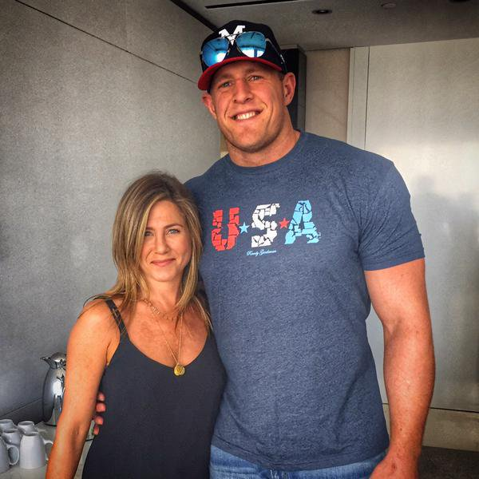

Multivariate distributions  
===================
date: James Scott (UT-Austin)
autosize: true
font-family: 'Gill Sans'
transition: none

Reference: Bertsekas Chapters 2.5-2.7, 3.4-3.5, 4.5, 4.7  

Outline
=====

- Joint distributions  
- Marginal and conditional distributions  
- Covariance and correlation  

***

- Linear combinations of random variables   
- Bivariate normal distribution    
- Regression to the mean  

Joint distributions
=======

Suppose that $X$ and $Y$ are two random variables associated with the same underlying uncertain outcome.  
- $X$ = Arsenal score and $Y$ = Man U score for the same soccer game.  (We've seen this one already!) 
- $X$ = return on stocks and $Y$ = return on bonds in the same year.  
- $X$ = wind speed and $Y$ = precipitation in the same one-hour period.  
- $X$ = blood pressure and $Y$ = weight for a patient in a clinical trial of a new cholesterol drug.    

Joint PMF
=======

First suppose that $X$ and $Y$ are both discrete.  Then the joint PMF of $X$ and $Y$ is defined as

$$
p_{X,Y}(x,y) = P(X = x, Y = y)
$$

By analogy with the one-variable (univariate) case.  

Joint PMF: marginal distributions    
=======

If $X$ and $Y$ have joint PMF $f_{X,Y}(x,y)$, then we can compute the marginal distributions of $X$ and $Y$ as follows:  

$$
\begin{aligned}
f_X(x) & = \sum_{y} f_{X,Y}(x,y)  \\
f_Y(y) & = \sum_{x} f_{X,Y}(x,y)  
\end{aligned}
$$

This is just the rule of total probability!  

Joint PMF: example  
=======

Let $X_{be}$ be the number of bedrooms in a house, and let $X_{ba}$ be the number of bathrooms.  The following matrix specifies a joint probability distribution $P(X_{ba}, X_{be})$, taken from sales data on Austin houses:  

         | 1 ba | 2 ba | 3 ba | 4 ba | __Marginal__ |
---------|---|---|---|---|---------|
1 bed | 0.003 | 0.001 | 0.000 | 0.000 | __0.004__  |
2 bed | 0.068 | 0.113 | 0.020 | 0.000 | __0.201__  |
3 bed | 0.098 | 0.249 | 0.126 | 0.004 |  __0.477__  |
4 bed | 0.015 | 0.068 | 0.185 | 0.015 | __0.283__  |
5 bed | 0.002 | 0.005 | 0.017 | 0.006 | __0.030__  |
6 bed | 0.001 | 0.001 | 0.002 | 0.001 | __0.005__  |
__Marginal__ | __0.187__ | __0.437__ | __0.350__ | __0.026__  | __1__ |

Conditional distributions    
=======

Suppose that $X$ and $Y$ have joint PMF $f_{X,Y}(x,y)$, and that we know $Y$ takes on some particular value $y$.  What does that tell us about $X$?  

This is captured by the conditional PMF $p_{X \mid Y}$, which is defined as follows:

$$
p_{X\mid Y}(x \mid y) = \frac{p_{X,Y}(x,y)}{p_{Y}(y)}  \\
$$

This is by analogy with the multiplication rule for probabilities.  

Conditional distributions    
=======

Let's go back to our joint distribution over number of bedrooms and bathrooms for Austin houses:

         | 1 ba | 2 ba | 3 ba | 4 ba | __Marginal__ |
---------|---|---|---|---|---------|
1 bed | 0.003 | 0.001 | 0.000 | 0.000 | __0.004__  |
2 bed | 0.068 | 0.113 | 0.020 | 0.000 | __0.201__  |
3 bed | 0.098 | 0.249 | 0.126 | 0.004 |  __0.477__  |
4 bed | 0.015 | 0.068 | 0.185 | 0.015 | __0.283__  |
5 bed | 0.002 | 0.005 | 0.017 | 0.006 | __0.030__  |
6 bed | 0.001 | 0.001 | 0.002 | 0.001 | __0.005__  |
__Marginal__ | __0.187__ | __0.437__ | __0.350__ | __0.026__  | __1__ |

What is $p(X_{be} \mid X_{ba} = 3)$?  

Conditional distributions    
=======

Let's go back to our joint distribution over number of bedrooms and bathrooms for Austin houses:

         | 1 ba | 2 ba | 3 ba | 4 ba | __Marginal__ |
---------|---|---|---|---|---------|
1 bed | 0.000 | 0.000 | 0.000 | 0.000 | __0.004__  |
2 bed | 0.000 | 0.000 | 0.020 | 0.000 | __0.201__  |
3 bed | 0.000 | 0.000 | 0.126 | 0.000 |  __0.477__  |
4 bed | 0.000 | 0.000 | 0.185 | 0.000 | __0.283__  |
5 bed | 0.000 | 0.000 | 0.017 | 0.000 | __0.030__  |
6 bed | 0.000 | 0.000 | 0.002 | 0.000 | __0.005__  |
__Marginal__ | __0.000__ | __0.000__ | __0.350__ | __0.000__  | __1__ |

Conceptually, this is like focusing on the column for $X_{ba} = 3$ and zeroing everything else out.  __This is our "new universe."__    

Conditional distributions    
=======

Let's go back to our joint distribution over number of bedrooms and bathrooms for Austin houses:

         | 3 ba | __Marginal__ |
---------|---|---|---|---|---------|
1 bed | 0.000 | __0.004__  |
2 bed | 0.020 | __0.201__  |
3 bed | 0.126 | __0.477__  |
4 bed | 0.185 | __0.283__  |
5 bed | 0.017 | __0.030__  |
6 bed | 0.002 | __0.005__  |
__Marginal__  | __0.350__  | __1__ |

So let's forget those other columns (keeping the marginal distribution over $X_{be}$ for reference)...

Conditional distributions    
=======

Let's go back to our joint distribution over number of bedrooms and bathrooms for Austin houses:

         | 3 ba | __Marginal__ |
---------|---|---|---|---|---------|
1 bed | 0.000/0.350 | __0.004__  |
2 bed | 0.020/0.350 | __0.201__  |
3 bed | 0.126/0.350 | __0.477__  |
4 bed | 0.185/0.350 | __0.283__  |
5 bed | 0.017/0.350 | __0.030__  |
6 bed | 0.002/0.350 | __0.005__  |
__Marginal__  | __0.350/0.350__  | __1__ |

Now we divide through by the marginal probability $P(X_{ba} = 3)$ to make sure that the probabilities sum to 1.  

Conditional distributions    
=======

Let's go back to our joint distribution over number of bedrooms and bathrooms for Austin houses:

         | 3 ba | __Marginal__ |
---------|---|---|---|---|---------|
1 bed | 0.000 | __0.004__  |
2 bed | 0.057 | __0.201__  |
3 bed | 0.360 | __0.477__  |
4 bed | 0.529 | __0.283__  |
5 bed | 0.049 | __0.030__  |
6 bed | 0.006 | __0.005__  |
__Marginal__ |  __1__ | __1__ |

We're left with the conditional PMF $p(x_{be} \mid X_{ba} = 3)$.  Notice how the knowledge that $X_{ba} = 3$ shifts the probabilities.

Conditional expectation
======

- A conditional PMF is an ordinary PMF over a "new universe" determined by the conditioning event.  
- Similarly, a conditional expectation is an ordinary expectation over the same "new universe".  All probabilities and PMFs are replaced by their conditional versions.    

$$
E(X \mid Y=y) = \sum_x x \cdot p_{X \mid Y}(x \mid y)
$$

- The "rule of total expectation" is similar to the rule of total probability.  It says that the overall average is the average of the conditional averages.  

$$
E(X) = \sum_{y} p_{Y}(y) \cdot E(X \mid Y=y)
$$

Total expectation: example
=====

At my wedding, there were my friends and family (the American side, about 40% of the guests) and my wife's friends and family (the Irish side, about 60% of the guests).  

Total expectation: example
=====

- Suppose the American guests drank $X \sim$ Poisson(3) drinks per person.  
- The Irish guests drank more: say $X \sim$ Poisson(5) drinks per person.  

How many drinks should we have expected to serve?  Use total expectation:  

$$
\begin{aligned}
E(X) &= P(A) \cdot E(X \mid A) + P(I) \cdot E(X \mid I) \\
&= 0.4\cdot 3 + 0.6 \cdot 5 \\
& = 4.2  
\end{aligned}
$$

Joint PDF 
=======

Now suppose that $X$ and $Y$ are both continuous random variables.  We say that a function $f_{X,Y}(x,y)$ is the joint PDF of $X$ and $Y$ if, for every $S_X, S_Y$,

$$
P(X \in S_X, Y \in S_Y) = \int_{S_Y} \int_{S_X}  f_{X,Y}(x,y) \ dx \ dy 
$$

By analogy with the univariate case.

Every joint PDF must be nonnegative and integrate to 1 over $(x,y) \in \mathbb{R} \times \mathbb{R}$:

$$
\int_{-\infty}^{\infty} \int_{-\infty}^{\infty} f_{X,Y}(x,y) \ dx \ dy = 1
$$

Joint PDF: Example
=======

$$
f(x, y) = 
\left\{
\begin{array}{ll}
x + y , &  0 \leq x \leq 1, 0 \leq y \leq 1 \\
0, & \mbox{otherwise}
\end{array}
\right.
$$

Joint PDF: Example
=======
type: prompt 

$$
f(x, y) = 
\left\{
\begin{array}{ll}
x + y , &  0 \leq x \leq 1, 0 \leq y \leq 1 \\
0, & \mbox{otherwise}
\end{array}
\right.
$$

__Verify that $f(x,y)$ is a PDF.__ (That is: show that it's nonnegative and integrates to 1.)

Marginal and conditional distributions
=======

By analogy with the discrete case, we can define the marginal and conditional distributions associated with a joint PDF.

The marginal and conditional PDFs of $X$ are:  

$$
\begin{aligned}
f_X(x) &= \int_{\mathbb{R}} f_{X,Y}(x, y) \ dy  \\
f_{X \mid Y}(x \mid y) &= \frac{f_{X,Y}(x,y)} {f_{Y}(y)} =  \frac{f_{X,Y}(x,y)} {\int_{\mathbb{R}} f_{X,Y}(x, y) \ dx}
\end{aligned}
$$

Independence
=======

Recall that two random variables $X$ and $Y$ are independent if for every $A$ and $B$, $P(X \in A, Y \in B) = P(X \in A) \cdot P(Y \in B)$.  
- In principle, to verify independence, we'd need to show this for all possible sets $A$ and $B$.  Very tedious!  
- Luckily there is a simpler condition for continuous random variables.  Suppose that $X$ and $Y$ have joint PDF $f_{X,Y}(x,y)$.  Then $X$ and $Y$ are independent if and only if, for all $(x,y)$, 

$$
f_{X,Y}(x,y) = f_X(x) \cdot f_Y(y)  
$$

That is: the joint density factorizes as the product of two marginal densities.  _Much easier to verify._  

Independence: example
=======
type: prompt

Suppose that 

$$
f_{X,Y}(x,y) = 2e^{-(x+2y)}  
$$

Show that $X$ and $Y$ are independent.  

Independence: example
=======

Suppose that 

$$
f_{X,Y}(x,y) = 2e^{-(x+2y)}  
$$

Show that $X$ and $Y$ are independent.  

Proof: 

$$
\begin{aligned}
f_{X,Y}(x,y) &= 2e^{-(x+2y)}    \\
&= e^{-x} 2e^{-2y} \\
&= f_X(x) \cdot f_Y(y)
\end{aligned}  
$$

Correlation and covariance
=======

Let's return to our joint distribution over bedrooms and bathrooms on houses in Austin:   

         | 1 ba | 2 ba | 3 ba | 4 ba | __Marginal__ |
---------|---|---|---|---|---------|
1 bed | 0.003 | 0.001 | 0.000 | 0.000 | __0.004__  |
2 bed | 0.068 | 0.113 | 0.020 | 0.000 | __0.201__  |
3 bed | 0.098 | 0.249 | 0.126 | 0.004 |  __0.477__  |
4 bed | 0.015 | 0.068 | 0.185 | 0.015 | __0.283__  |
5 bed | 0.002 | 0.005 | 0.017 | 0.006 | __0.030__  |
6 bed | 0.001 | 0.001 | 0.002 | 0.001 | __0.005__  |
__Marginal__ | __0.187__ | __0.437__ | __0.350__ | __0.026__  | __1__ |

Correlation and covariance
=======

This distribution has the following moments:  

$$
\begin{aligned}
E(X_{ba}) &= 0.187 \cdot 1 + 0.437 \cdot 2 + 0.350 \cdot 3 + 0.026 \cdot 4 \\
& = 2.215\\
\mbox{var}(X_{ba}) & = 0.595 \\
E(X_{be}) & = 3.149 \\
\mbox{var}(X_{be}) & = 0.643 
\end{aligned}
$$

But this tells us nothing about how the two variables are related!  They only tell us about the two variables in isolation, rather than the way they vary together.  

Correlation and covariance
=======

In this sense, a quantitative relationship is much like a human relationship: you can't describe one by simply listing off facts about the characters involved.  

Correlation and covariance
=======

- Homer: likes donuts, works at the Springfield Nuclear Power Plant, crude, obese, incompetent, still a decent guy.  
- Marge: wears her hair in a beehive, despises the _Itchy and Scratchy Show_, takes an active interest in the local schools.  
- Yet these facts alone tell you nothing about their marriage.  
- A quantitative relationship is the same way: if you ignore the interactions of the "characters," or individual variables involved, then you will miss the best part of the story.

Correlation and covariance
=======

Here's the intuition behind covariance.  Let $X$ and $Y$ be two random variables with expected values $\mu_X$ and $\mu_Y$, respectively.

Now consider the quantity $(X - \mu_x)(Y-\mu_y)$.  This "cross term" measures how $X$ and $Y$ behave together:  
- If $X$ and $Y$ are on the same sides of their means, this cross term is positive.  
- If $X$ and $Y$ are on opposite sides of their means, this cross term is negative.  
- The key question is: which effect dominates?  Same-side outcomes, or opposite-side outcomes?   

Correlation and covariance
=======

$(X - \mu_x)(Y-\mu_y)$ mostly positive.  

Correlation and covariance
=======

$(X - \mu_x)(Y-\mu_y)$ mostly negative.    

Correlation and covariance
=======

So we define the covariance of $X$ and $Y$ as

$$
\mbox{cov}(X, Y) = E_{X,Y} \left\{ (X - \mu_x)(Y-\mu_y) \right\}
$$

and the correlation as

$$
\mbox{cor}(X, Y) = \frac{\mbox{cov}(X, Y)}{\sigma_x \cdot \sigma_y}
$$

where $\sigma_X$ and $\sigma_Y$ are the standard deviations of $X$ and $Y$.  

Correlation and covariance
=======

So for our example:

         | 1 ba | 2 ba | 3 ba | 4 ba | __Marginal__ |
---------|---|---|---|---|---------|
1 bed | 0.003 | 0.001 | 0.000 | 0.000 | __0.004__  |
2 bed | 0.068 | 0.113 | 0.020 | 0.000 | __0.201__  |
3 bed | 0.098 | 0.249 | 0.126 | 0.004 |  __0.477__  |
4 bed | 0.015 | 0.068 | 0.185 | 0.015 | __0.283__  |
5 bed | 0.002 | 0.005 | 0.017 | 0.006 | __0.030__  |
6 bed | 0.001 | 0.001 | 0.002 | 0.001 | __0.005__  |
__Marginal__ | __0.187__ | __0.437__ | __0.350__ | __0.026__  | __1__ |

Correlation and covariance
=======

We have a sum over all possible combinations of joint outcomes for $X$ and $Y$, weighted by their joint probabilities:

$$
\begin{aligned}
\mbox{cov}(X_{ba},X_{be}) &= \sum_{x,y} P(X_{ba}=x, X_{be}=y) \cdot ( x - \mu_{ba}) ( y - \mu_{be} )  \\
&= 0.003 \cdot (1 - 2.215) (1 - 3.149) + 0.068 \cdot (1 - 2.215) (2 - 3.149) \\
&+ \cdots + 0.185 \cdot (3 - 2.215) (4 - 3.149) \\
&+ \cdots + 0.005 \cdot (4 - 2.215) (6 - 3.149) \\
&\approx 0.285 \, .
\end{aligned}
$$

So $\mbox{cor}(X,Y) = 0.285/\sqrt{0.595\cdot 0.643} \approx 0.46$.  

Correlation and covariance
=======

Some properties:  
- $-1 \leq \mbox{cor}(X, Y) \leq 1$.  
- $\mbox{cov}(X,Y) = E(XY) - E(X) \cdot E(Y)$
- If $X$ and $Y$ are independent, then $\mbox{cov}(X,Y) = 0$.  _The converse is not necessarily true._  
- The covariance of $X$ with itself is the variance:  

$$
\mbox{cov}(X,X) = \mbox{var}(X)  
$$

Correlation and covariance
=======
type: prompt

_Practice problem 1._ Suppose we have two random variables $X$ and $Y$, and we define $\tilde{X} = aX + c$ and $\tilde{Y} = bY + d$.  Show that

$$
\mbox{cov}(\tilde{X}, \tilde{Y}) = a \cdot b \cdot \mbox{cov}(X,Y)  \, .
$$

Hint: use the definition together with linearity of expectation.  

Correlation and covariance
=======
type: prompt

_Practice problem 2._  Suppose that $X$ has PMF

$$
p_X(x) = \left\{
\begin{array}{ll}
1/4 & \mbox{if } x = -1 \\
1/2 & \mbox{if } x = 0 \\
1/4 & \mbox{if } x = 1 \\
0 & \mbox{otherwise.} 
\end{array}
\right.
$$

Suppose that $Y = X^2$.  Show that $X$ and $Y$ are not independent, but that $\mbox{cov}(X, Y) = 0$.  

Linear combinations of RVs   
====

Suppose that $X$ and $Y$ are two random variables associated with the same uncertain outcome. Define a new random variable $Z = aX + bY + c$, where a, b, and c are given scalars.

Then

$$
E(Z) = E(aX + bY + c) = aE(X) + bE(Y) + c  
$$

__The expectation of the sum is the sum of the expectations.__

Linear combinations: Example  
====

- Suppose $X$ is the return on stocks next year, with $E(X) = 0.07$.  
- Suppose $Y$ is the return on 10-year US Treasury Bonds next year, with $E(Y) = 0.03$.
- Let $Z = 0.8X + 0.2Y$ be the return on a retirement portfolio with 80% stocks and 20% bonds.  Then 

$$
\begin{aligned}
E(Z) &= E(0.8X + 0.2Y) \\
&= 0.8 \cdot E(X) + 0.2\cdot E(Y) \\
& = 0.8 \cdot 0.07 + 0.2 \cdot 0.03 = 0.062
\end{aligned}
$$  

- Holds even if stocks and bonds aren't independent (and they aren't).    

Linear combinations of RVs 
====

These ideas extend naturally to the case of more than two random variables.  For example, suppose that $X_1, X_2, \ldots, X_N$ are all different random variables.  Define

$$
Z = a_1 X_1 + a_2 X_2 + \cdots a_N X_N = \sum_{i=1}^N a_i X_i \\
$$

Again, __the expectation of the sum is the sum of the expectations:__

$$
E(Z) = E \left( \sum_{i=1}^N a_i X_i \right) = \sum_{i=1}^N a_i E(X_i)
$$

Linear combinations of RVs 
====

There's an analogous rule for the variance: again, let

$$
Z = a_1 X_1 + a_2 X_2 + \cdots a_N X_N = \sum_{i=1}^N a_i X_i \\
$$

__If $X_i$ and $X_j$ are independent for all $i\neq j$,__ then:  

$$
\mbox{var}(Z) = \mbox{var} \left( \sum_{i=1}^N a_i X_i \right) = \sum_{i=1}^N a_i^2 \mbox{var}(X_i)
$$

The independence assumption is important! 

Example: the binomial
====

We can use this to calculate the binomial mean and variance. 

Imagine trying to calculate these directly from the definition.  Suppose $X \sim$ Binomial(N, p).  Then from the definition of expected value:  

$$
\begin{aligned}
E(X) &= \sum_{k=0}^N k \cdot P(X = k) \\
 &= \sum_{k=0}^N k \cdot \binom{N}{k} p^k (1-p)^{N-k}  \, .
 \end{aligned}  
$$

What a giant algebra headache!  (And the variance is even worse.)

Example: the binomial
====

Instead, we can use our cute results for the expected value and variance of a linear combination.  

We know that a binomial random variable is the number of 1's in a sequence of independent Bernoulli trials. So if $X \sim$ Binomial(N, p), then we can write $X$ as:

$$
X = B_1 + B_2 + B_3 + \cdots + B_N
$$

where each $B_i \sim$ Bernoulli(p).  

Example: the binomial
====

Now apply what we know:

$$
\begin{aligned}
E(X) &= E(B_1 + B_2 + B_3 + \cdots + B_N) \\
&= E(B_1) + E(B_2) + E(B_3) + \cdots + E(B_N) \\
&= p + p + p + \cdots + p \quad \mbox{(N times)}\\
&= Np
\end{aligned}
$$

Example: the binomial
====

Similarly, since each $B_i$ is independent of the others,  

$$
\begin{aligned}
\mbox{var}(X) &= \mbox{var}(B_1 + B_2 + B_3 + \cdots + B_N) \\
&= \mbox{var}(B_1) + \mbox{var}(B_2) + \mbox{var}(B_3) + \cdots + \mbox{var}(B_N) \\
&= p(1-p) + p(1-p) + p(1-p) + \cdots + p(1-p) \quad \mbox{(N times)}\\
&= Np(1-p)  
\end{aligned}
$$

So easy!  

Linear combinations in general
====

But what if the independence assumption is not true?  In general, if

$$
Z = a_1 X_1 + a_2 X_2 + \cdots a_N X_N = \sum_{i=1}^N a_i X_i \\
$$

Then

$$
\mbox{var}(Z) = \mbox{var} \left( \sum_{i=1}^N a_i X_i \right) = \sum_{i=1}^N a_i^2 \mbox{var}(X_i) + 2 \sum_{i \neq j} a_i a_j \mbox{cov}(X_i, X_j)
$$

Linear combinations in general
====

Back to our example:  
- $X$ = return on stocks, with $E(X) = 0.07$ and $\mbox{var}(X) = 0.20^2$.   
- $Y$ = return on 10-year US Treasury Bonds, with $E(Y) = 0.03$ and $\mbox{var}(X) = 0.06^2$. 
- Say $\mbox{cor}(X,Y) = -0.5$, so that $\mbox{cov}(X,Y) = -0.5 \cdot 0.20 \cdot 0.06 = -0.006$.  
- Let $Z = 0.8X + 0.2Y$ be the return on a retirement portfolio with 80% stocks and 20% bonds.    What are $E(Z)$ and $\mbox{var}(Z)$?  

Linear combinations in general
====

We already calculated $E(Z)$, and the assumption of non-zero correlation doesn't change things:  

$$
\begin{aligned}
E(Z) &= E(0.8X + 0.2Y) \\
&= 0.8 \cdot E(X) + 0.2\cdot E(Y) \\
& = 0.8 \cdot 0.07 + 0.2 \cdot 0.03 = 0.062
\end{aligned}
$$  

Linear combinations in general
====

But we need the more general formula to calculate the variance:  

$$
\begin{aligned}
\mbox{var}(Z) &= \mbox{var}(0.8X + 0.2Y) \\
&= 0.8^2 \cdot \mbox{var}(X) + 0.2^2 \cdot \mbox{var}(Y) + 2 \cdot 0.8 \cdot 0.2 \cdot \mbox{cov}(X,Y) \\
& = 0.8 \cdot 0.2^2 + 0.2 \cdot 0.06^2 + 2 \cdot 0.8 \cdot 0.2 \cdot (-0.006) \\
&= 0.0308 
\end{aligned}
$$  

So $\mbox{sd}(Z) = \sqrt{0.0308} = 0.175$.  Negative covariance = more diversification.

Linear combinations in general
====

What if the correlation were $+0.5$ instead?  Then:   

$$
\begin{aligned}
\mbox{var}(Z) &= \mbox{var}(0.8X + 0.2Y) \\
&= 0.8^2 \cdot \mbox{var}(X) + 0.2^2 \cdot \mbox{var}(Y) + 2 \cdot 0.8 \cdot 0.2 \cdot \mbox{cov}(X,Y) \\
& = 0.8 \cdot 0.2^2 + 0.2 \cdot 0.06^2 + 2 \cdot 0.8 \cdot 0.2 \cdot (0.006) \\
&= 0.03464 
\end{aligned}
$$  

So $\mbox{sd}(Z) = \sqrt{0.03464} = 0.186$.  Positive covariance = higher risk.  

General transformations
======

What if $Z = g(X, Y)$ is a general transformation? Things are not so nice (see Ch. 3.6 of Bertsekas for details).  If $X$ and $Y$ are discrete, then  

$$
\begin{aligned}
P_Z(z) &= \sum_{(x, y): g(x,y) = z)} p_{X,Y}(x,y)  \\
E(Z) = E(g(X,Y)) & = \sum_{x, y} g(x,y) \ p_{X,Y}(x,y) 
\end{aligned}
$$

If $X$ and $Y$ are continuous, then sums become integrals:  

$$
E(Z) = E(g(X,Y))= \int_{x, y} g(x,y) f_{X,Y}(x,y) \ dx \ dy
$$

Bivariate normal distribution
=====

The bivariate normal distribution is our first example of a parametric probability model with correlation "baked in."

It describes the joint distribution of two correlated continuous random variables $X_1$ and $X_2$ associated with the same uncertain phenomenon, e.g.:
- Stocks and bonds in same year  
- Height of mom and height of child  
- Batting average last year and batting average this year for the same baseball player.  
- Creatinine and albumin levels for a kidney patient.  

Bivariate normal distribution
=====

Recall that the ordinary normal distribution has two parameters: a mean and a variance.  The bivariate normal distribution has five parameters:
- The mean and variance of the first random variable: $\mu_1 = E(X_1)$ and $\sigma^2_1 = \mbox{var}(X_1)$.
- The mean and variance of the second random variable: $\mu_2 = E(X_2)$ and $\sigma^2_2 = \mbox{var}(X_2)$.
- The covariance between $X_1$ and $X_2$, which we denote as $\sigma_{12}$. 

In practice we often refer to the standard deviations $\sigma_1$ and $\sigma_2$ and correlation $\rho = \sigma_{12}/(\sigma_1 \sigma_2)$, and use the shorthand $(X_1, X_2) \sim N(\mu_1, \mu_2, \sigma_1, \sigma_2, \rho)$.

Bivariate normal distribution
=====
right: 60%

The PDF of the bivariate normal distribution looks like what you see at right.    

[See, e.g. MathWorld for the equation of the density function](http://mathworld.wolfram.com/BivariateNormalDistribution.html) (which doesn't convey a lot of intuition).  

***

Bivariate normal distribution
=====

Bivariate normal distribution
=====

Example 1: baseball averages
=====

Here $\rho = 0.303$.  

Example 2: asset returns
=====

Bivariate normal properties
=====

We can also write a bivariate normal distribution using matrix--vector notation, to emphasize the fact that $X = (X_1, X_2)$ is a random vector:

$$
\left(
\begin{array}{r}
X_1 \\
X_2
\end{array}
\right)
\sim N \left(
\left[
\begin{array}{r}
\mu_1 \\
\mu_2
\end{array}
\right]
\; ,
\left[
\begin{array}{r r}
\sigma^2_1 & \sigma_{12} \\
 \sigma_{12}  & \sigma_2^2 
\end{array}
\right]
\right) \, ,
$$

or simply $X \sim N(\mu, \Sigma)$, where $\mu$ is the mean vector and $\Sigma$ is called the covariance matrix.

Bivariate normal properties
=====

The bivariate normal distribution has the nice property that each of its two marginal distributions are ordinary normal distributions:  
- $X_1 \sim N(\mu_1, \sigma_1^2)$  
- $X_2 \sim N(\mu_2, \sigma_2^2)$.

Its conditional distributions $p(X_1 \mid X_2 = x_2)$ are also nice and easy!  But that requires a detour past the topic of _regression to the mean_.  

The curious case of Altuve and Drew
=====

Let's revisit our example on baseball averages: specifically, the curious case of Jose Altuve and Stephen Drew.    

The curious case of Altuve and Drew
=====
type: prompt

Altuve:
- Had a .341 average in 2014, leading the league.  
- Had a .313 average in 2015: good, but not as good.  

Drew: 
- Had a .163 average in 2014, almost worst in the league.  
- Had a .201 average in 2015: bad, but not as bad.  

Similar patterns hold for other players... __why?__ 

The genetics of extreme height  
=====

We see similar patterns in other data sets.   For example, let's talk heights---specifically, the genetics of being very tall.  

The genetics of extreme height  
=====

No, I mean _really_ tall!

The genetics of extreme height  
=====

Here's a famous data set on heights from Karl Pearson.  

The genetics of extreme height  
=====

Consider the 20 tallest fathers (blue).  
- Mean height: 6.2 inches above their generation's average.
- Their sons: 2.8 inches above their generation's average.

Now consider the 20 shortest fathers (red).
- Mean height: 6.9 inches below their generation's average.
- Their sons: 3.3 inches below their generation's average.  

Again, __why__?  

Regression to the mean
=====

The answer is a statistical phenonenon called _regression to the mean._  Here's the basic idea.  
- An outlier like Jose Altuve must have had an outstanding year in 2014 because of two reasons: above-average skill and above-average luck.  
- In 2015: his skill persisted but his luck averaged out.  So his performance regressed to the mean: still good, but not _as good._  
- Similarly, a negative outlier Stephen Drew had such a poor year in 2014 because of two reasons: below-average skill and below-average luck.  
- In 2015: his skill persisted but his luck averaged out.  So his performance regressed to the mean: still bad, but not _as bad._    

Regression to the mean
=====

And for the heights example:  
- Height outliers, like Yao Ming, turn out that way for a combination of two reasons: genes and  luck.  (Here "luck" is used to encompass both environmental forces as well as some details of multifactorial inheritance not worth going into here.)  
- Therefore, our group of very tall fathers (the blue dots) is biased in two ways: extreme genes _and_ extreme luck.
- These very tall people pass on their genes to their children, but not their luck.
- Height luck will tend to average out in the next generation.  Therefore, the children of very tall parents will still be tall (because of genes), but not as tell as their parents (because they weren't as lucky, on average).  

Regression to the mean
=====

This is quite general:  
- Take any pair of correlated random variables $(X_1, X_2)$.  
- If one measurement is extreme (i.e. cherry picked from the outliers), then the other measurement will tend to be less extreme.
- __This is not a guarantee__.  The key words are _tend to_: it just happens on average!

The punch line is that we can make this phenomenon mathematically precise via the _conditional distributions of the bivariate normal distribution._

Bivariate normal conditionals
=====

To make this precise, say we fix the value of $X_1$ at some known value $x_1$.  

What is the conditional probability distribution of $X_2$, given that $X_1 = x_1$?

In our heights example, this would be like asking: what is the distribution for the heights of sons ($X_2$) for fathers whose height is 2 inches above the mean ($X_1 = 2$)?

Bivariate normal conditionals
=====

Suppose that $X_1$ and $X_2$ follow a bivariate normal distribution, i.e.

$$
(X_1, X_2) \sim N(\mu_1, \mu_2, \sigma_1, \sigma_2, \rho) \, ,
$$

Then $P(X_2 \mid X_1 = x_1)$ is an ordinary normal distribution, with mean and variance

$$
\begin{aligned}
E(X_2 \mid X_1 = x_1) &= \mu_2 + \rho \cdot \frac{\sigma_2}{\sigma_1} \cdot (x_1 - \mu_1) \label{eqn:bvnconditional_mean} \\
\mbox{var}(X_2 \mid X_1 = x_1) &= \sigma^2_2 \cdot (1- \rho^2) \label{eqn:bvnconditional_variance} \, , 
\end{aligned}
$$

Notice that the conditional mean $E(X_2 \mid X_1 = x_1)$ is a linear function of $x_1$.  

Bivariate normal conditionals
=====

Let's re-express the conditional mean in a slightly different way:

$$
\frac{E(X_2 \mid X_1 = x_1) - \mu_2}{\sigma_2} = \rho \cdot \left( \frac{x_1 - \mu_1}{\sigma_1}  \right) \, .
$$

Or if we let $Z_i = (X_i - \mu_i)/\sigma_i$ be the z-score, then

$$
E(Z_2 \mid Z_1 = z_1) = \rho \cdot z_1
$$

If $X_1$ is $z_1$ standard deviations above it's average, then we expected $X_2$ to be $\rho \cdot z_1$ standard deviations above its own average.  Because $\rho$ can never exceed 1, we expect that $X_2$ will be "shrunk" a bit closer to its mean than $x_1$ was---and the weaker the correlation between the two variables, the stronger this shrinkage effect is.

Example
=====

Best-fitting bivariate normal for the heights data has $\rho = 0.5$.  

Example
=====

Let's consider fathers whose heights are about 2 inches above average ($X_1 = 2$).  

What is $E(X_2 \mid X_1 = 2)$?  Using our equation for the conditional mean, we find that:

$$
E(X_2 \mid X_1 = 2) = \rho \cdot \frac{\sigma_2}{\sigma_1} \cdot 2  = 0.5 \cdot \frac{2.81}{2.75} \cdot 2 \approx 1.03 \, .
$$

That is, the sons should be about 1 inch taller than average for their generation (rather than 2 inches taller, as their fathers were).  _Regression to the mean!_  

Example
=====

And the data bears out the math:  

