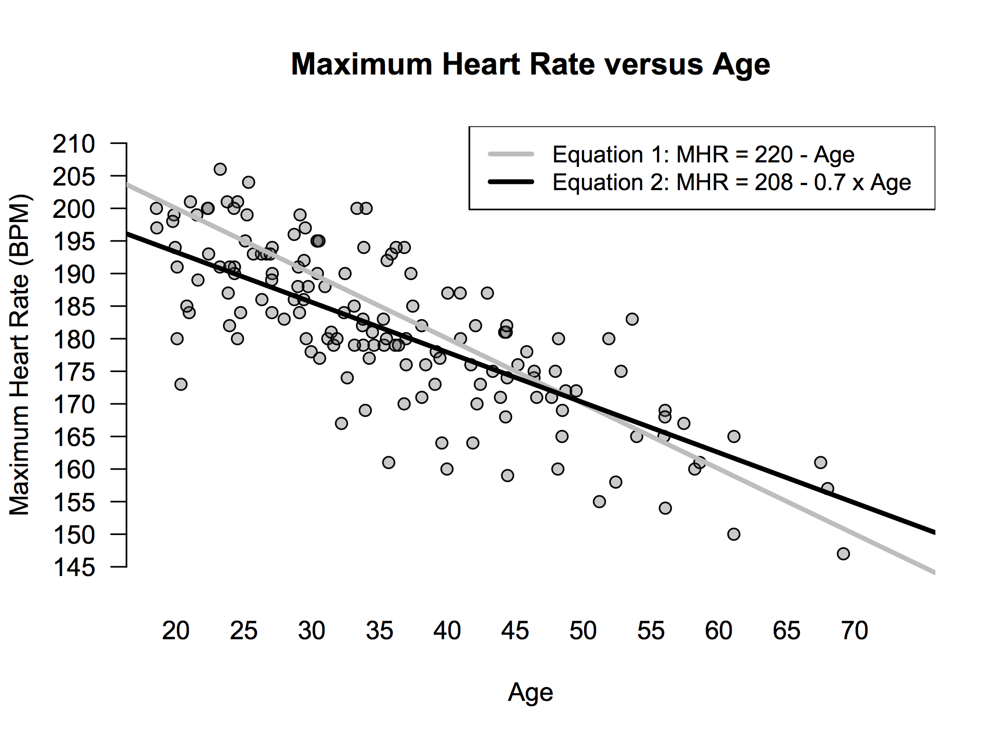

Fitting equations
===================
date: James Scott (UT-Austin) 
autosize: true
font-family: 'Gill Sans'
transition: none


<style>
.small-code pre code {
  font-size: 1em;
}
</style>


Reference: "Data Science" Chapter 2.


Fitting equations
========

So far we've concentrated on relatively simple visual and numerical summaries of data sets.

In many cases we will want to go further, by fitting an explicit equation, called a __regression model__ that describes how one variable ($y$) changes as a function of some other variables ($x$).  

This is process is called _regression_ or _curve fitting._  


Fitting equations
========

For example, you may have heard the following rule of thumb: to calculate your maximum heart rate, subtract your age from 220.

We can express this rule as an equation:  

$$
\mbox{MHR} = 220 - \mbox{Age}  
$$


Fitting equations
========

This equation comes from _data_:  
- recruit a bunch of people of varying ages 
- give them heart rate monitors  
- tell them to run so hard on a treadmill that they feel like throwing up      
- record their maximum heart rate  

Data from this kind of experiment looks like this... 


Fitting equations
========



It turns out that Equation 2 (MHR = 208 - 0.7 $\times$ Age) is a better equation: it makes smaller errors, on average.  


Fitting equations
========

Top three reasons for fitting an equation: 
- to make a prediction  
- to summarize the trend in a data set  
- to make fair comparisons that adjust for the systematic effect of some important variable  

Our heart rate example illustrates all three of these concepts.


Making a prediction
========

Alice is 28.  What is her predicted max heart rate?

Our equation expresses the _conditional expected value_ of MHR, given a specific value of age:  

$$
\mbox{E(MHR | Age)} = 208 - 0.7 \cdot 28 = 188.4  
$$


Summarizing a trend  
========

How does max heart rate tend to change with age?   

$$
\mbox{E(MHR | Age)}  = 208 - 0.7 \cdot \mbox{Age}
$$

So about 0.7 BPM slower, on average, with every additional year we age.  


Making fair comparisons
========

Let's compare two people whose max heart rates are measured using an actual treadmill test:  
- Alice is 28 with a maximum heart rate of 185.  
- Abigail is 55 with a maximum heart rate of 174.  

Who has a higher maximum heart rate _for her age_?  


Making fair comparisons
========

Key idea: compare actual MHR with predicted MHR.

Alice's actual MHR is 185, versus an expected MHR of 188.4 

$$
\begin{aligned}
\mbox{Actual} - \mbox{Predicted} &= 185 - (208 - 0.7 \cdot 28) \\
&= 185 - 188.4 \\
& = -3.4
\end{aligned}
$$


Making fair comparisons
========

Key idea: compare actual with predicted.

Abigail's actual MHR is 173, versus an expected MHR of 169.5 

$$
\begin{aligned}
\mbox{Actual} - \mbox{Predicted} &= 185 - (208 - 0.7 \cdot 55) \\
&= 174 - 169.5 \\
& = 4.5
\end{aligned}
$$


Making fair comparisons
========

So Abigail has a lower MHR, but a higher _age-adjusted_ MHR. The equation that relates MHR to age tells us how to place everyone on a level playing field, regardless of age.  

There are a lot of synonyms for this idea of making a "fair" comparison across different ages:  
- adjusting for age  
- statistically controlling for age  
- holding age constant  


Example: Austin food critics 
=====
class: small-code

Here are a few lines from a data set on Austin restaurants c.2013:


```
                 Name            Type FoodScore FeelScore Price
    Franklin Barbecue        Barbecue       9.5       5.5    15
     Kerbey Lane Cafe      Vegefusion       6.5       8.5    20
   Shoal Creek Saloon        Southern       4.6       8.5    25
                 Uchi Japanese,Modern       9.8       8.5    85
 Second Bar + Kitchen          Modern       8.7       9.0    50
             Lamberts    Southwestern       8.5       9.0    75
```

- Price = average price of dinner and drinks for one
- FoodScore = critics' rating out of 10


Example: Austin food critics 
=====


$$
\mbox{Price} = -6.2 + 7.9 \cdot \mbox{FoodScore} + \mbox{Error}
$$


Fitting straight lines
=====

In general, a linear model in one variable takes the form

$$
y_i = \beta_0 + \beta_1 x_i + e_i
$$

where:  
- $i$ indexes each data point  
- $y_i$ is the response and $x_i$ is the predictor (feature) for data point $i$  
- $\beta_0$ and $\beta_1$ are the _parameters_ of the model.    
- $e_i$ is the _model error_ or _residual_.  

"Fitting a model" = choosing $\beta_0$ and $\beta_1$ to make the model errors as small as possible on your data set.    


Fitting straight lines
=====

"Fitting a model" = choosing $\beta_0$ and $\beta_1$ to make the model errors as small as possible on your data set.    In practice "as small as possible" means "least squares."  Define the loss function 

$$
\begin{aligned}
l(\beta_0, \beta_1) &= \sum_{i=1}^N e_i^2 \\
&= \sum_{i=1}^N \left[ y_i - (\beta_0 + \beta_1 x_i) \right]^2
\end{aligned}
$$

__Ordinary least squares__ (OLS): choose $\beta_0$ and $\beta_1$ to make $l(\beta_0, \beta_1)$ as small as possible, i.e. to minimize the sum of squared model errors.  


Fitting straight lines
=====

It's a straightforward calculus problem to show that the OLS solution is:

$$
\begin{aligned}
\hat{\beta}_1 &= \frac{ \sum_{i=1}^n (x_i - \bar{x}) (y_i - \bar{y}) } {\sum_{i=1}^n (x_i - \bar{x})^2 } \\ \nonumber \\
\hat{\beta}_0 &= \bar{y} - \hat{\beta}_1 \bar{x} \,  ,
\end{aligned}
$$

Don't bother memorizing this!  Every statistical package on the planet has it built in.  (Plus, they'll probably make you derive it in Econometrics.)


Fitting straight lines
=====

Instead, let's focus on using the fitted equation for our three goals:  
- making a prediction  
- summarizing the trend in the data  
- statistical adjustment: making fair comparisons that adjust for some systematic effect  


Making a prediction
=====

Suppose you're opening a new restaurant and you've hired a chef with a proven track record of cooking at a 7.5 level.  

What price would you expect the Austin market to support for an average meal at your restaurant?  


Making a prediction: the algebra
=====

We know that $x = 7.5$.  Remember that our fitted equation expresses the _conditional expected value_ of $y$, given a specific value of $x$.  

So in light of our data on the Austin market, our best guess for price is

$$
E(y \mid x = 7.5) = -6.2 + 7.9 \cdot 7.5 = 53.05
$$

This would be a sensible starting point for thinking about menu pricing.  


Making a prediction: the geometry
=====


Summarizing a trend
=====

What dollar value does the Austin restaurant market seem to place on one extra point of food deliciousness?  

Recall our equation

$$
E(y \mid x) = -6.2 + 7.9 \cdot x
$$

That's \$7.90 per point of deliciousness, on average.  


Statistical adjustment
=====

What's the "best value" restaurant in Austin, i.e. the one that offers the most delicious food _for its price_?

Recall our key idea: compare actual with predicted.  


Statistical adjustment
=====


No surprises here: it's Franklin Barbecue!  Actual price is \$15 per person; predicted price is nearly \$70.  


To the code!
=====

Let's dig in to `afc_intro.R` and `afc.csv` on the class website.  


Your turn
=====
type: prompt

Download the data in `creatinine.csv` from the course website.  Each row is a patient in a doctor's office. 
- age: patient's age in years.  
- creatclear: patient's creatine clearance rate in mL/minute, a measure of kidney health (higher is better).  


Your turn
=====
type: prompt

Use this data to answer three questions:  
  1. What creatinine clearance rate should we expect, on average, for a 55-year-old?  
  2. How does creatinine clearance rate change with age?  
  3. Whose creatinine clearance rate is healthier (higher) for their age: a 40-year-old with a rate of 135, or a 60-year-old with a rate of 112?  


Beyond straight lines
========

Ordinary least squares is for linear models.  However, we can also use OLS to fit certain kinds of _nonlinear_ models.  We'll focus on four:  
- polynomial equations  
- piecewise polynomial equations, a.k.a. _splines_
- exponential growth and decay  
- power laws  

These models are special:  
- most nonlinear models cannot be fit using _ordinary_ least squares.  
- they need a more general technique called _nonlinear least squares_, which is for a more advanced course.  


Polynomial models
========

Data on gas consumption versyus temperature for a single-family house in Minnesota:  


The linear model doesn't fit so well!  


Polynomial models
========

But a quadratic model does!  


$$
\mbox{Gas Bill} = \$289 - 6.4 \cdot \mbox{Temp} + 0.03 \cdot \mbox{Temp}^2 + \mbox{Residual} \, .
$$


Polynomial models
========

In general, a polynomial model of degree $K$ takes the form

$$
E(y \mid x) = \beta_0 + \sum_{j = 1}^K \beta_j x^j  
$$

This model is nonlinear in $x$, but it can still be fit using OLS.


Polynomial models
========

There is a temptation to get a better fit by choosing a larger $K$.  This can get ridiculous:  


Polynomial models: over-fitting
========

For most data sets, beyond $K=2$ (quadratic) or $K=3$ (cubic), we rapidly get into dangerous _over-fitting_ territory:

Over-fitting occurs when a model just memorizes random noise in the data set, rather than describes the systematic relationship between $x$ and $y$.  

Severely overfit models usually have one or two dead giveaways:  
- non-intuitively wiggly interpolation behavior    
- crazy extrapolation behavior!


Polynomial models: over-fitting
========


In later courses, you'll learn formal diagnostics for over-fitting.  In the meantime: you'll pretty much know it when you see it. 


Let's dive in to `utilities.csv` and `utilities.R`.  


Polynomial models: splines
========

Another nice extension: piecewise-polynomial models, also known as splines.  

To fit a spline, we divide the range of the $x$ variable into nonoverlapping interals $I_0, I_1, I_2, \cdots, I_K$.  The breakpoints between the intervals are called _knots._  

We then fit a polynomial equation separately on each interval, "gluing" the individual polynomials together so that the overall curve is smooth.  


Polynomial models: splines
========

Here's some data on finishing times from runners in the 10-mile Cherry Blossom Road Race in Washington, D.C., held every April:  


```
  state time  net age sex
1    VA 7968 7789  27   F
2    NY 5152 4740  51   M
3    VA 4796 4581  29   F
4    VA 6874 6488  32   F
5    TN 6440 6280  31   F
6    VA 6976 6699  23   M
7    PA 5544 5281  54   M
8    DC 3647 3645  39   M
```


Polynomial models: splines
========


Three knots create four disjoint intervals (knots at the 25th, 50th, and 75th percentiles of temperature).  


Polynomial models: splines
========


Separate polynomials on each interval, glued together in a smooth fashion.  __What might explain the non-monotone behavior?__  (Code in `race_splines.R`.)  


