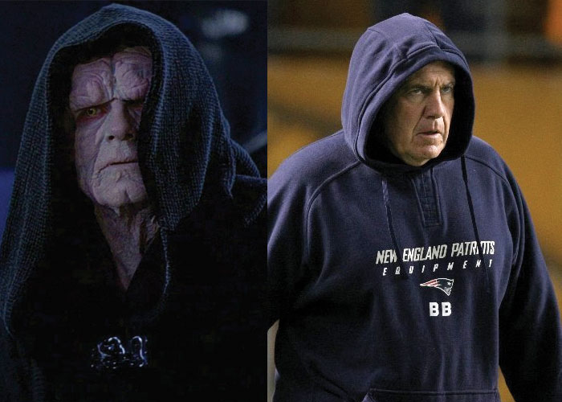
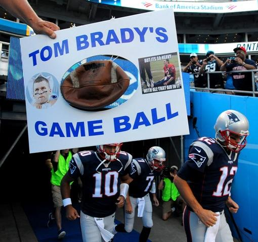

Hypothesis testing  
===================
date: James Scott (UT-Austin)
autosize: true
font-family: 'Gill Sans'
transition: none

Reference: "Data Science" Chapter 7  

Outline
=====

- An introductory example  
- The four steps of every hypothesis test  
- $p$-values  
- permutation tests  

The Patriots
=======

Unless you're from a narrow strip of land from Connecticut to Maine, you probably dislike the New England Patriots.  

The Patriots
=======

First of all, they win too much.  

The Patriots
=======

Then there's Tom Brady, their star quarterback... 

"The more hydrated I am, the less likely I am to get sunburned."  --TB12  

The Patriots
=======

And Bill Belichick, their coach...

The Patriots
=======

And of course, the cheating!  

The Patriots
=======
incremental: true 

But could even the Patriots cheat at the _pre-game coin toss?_  

Many people think so!  

The Patriots
=======

The Patriots
=======
incremental: true

For a 25-game stretch during the 2014 and 2015 NFL seasons, the Patriots won the pre-game coin toss 19 out of 25 times, for a suspiciously high winning percentage of 76%.  

Shannon Sharpe: "This proves that either God or the devil is a Patriots fan, and it can't possibly be God."  

The Patriots
=======

"Use the Force..."

The Patriots
=======

But before we invoke religion or the Force to explain this fact, let's consider the innocent explanation first: blind luck.  
- If you toss a coin over and over again, you'll see some long streaks with more heads, and some with more tails, just by luck.  
- Is it plausible that the Patriots just went on a lucky 25-game streak?  

The Patriots
=======

To the code in `patriots.R`!  Let's simulate some coin flips.  

Summary
=======

This simple example has all the major elements of _hypothesis testing_:  
  1. We have a _null hypothesis_, that the pre-game coin toss in the Patriots' games was truly random.  
  2. We use a _test statistic_, number of Patriots' coin-toss wins, to measure the evidence against the null hypothesis.  
  3. We calculated the probability distribution of the test statistic, assuming that the null hypothesis is true.  Here, we just ran a Monte Carlo simulation of coin flips, assuming an unbiased coin.  
  4. Finally, we used this probability distribution to assess whether the null hypothesis looked believable in light of the data.  

Summary
=======

Summary
=======

All hypothesis testing problems have these same four elements.  

  1. A null hypothesis $H_0$.  
  2. A test statistic $T \in \mathcal{T}$ that summarizes the data and measures the evidence against the null hypothesis.  (More extreme values of $T$ mean stronger evidence.)  
  3. $P(T \mid H_0)$:  the sampling distribution of the test statistic, assuming that the null hypothesis is true.  _This provides context for our measurement in step 2._  
  4. An assessment: in light of what we see in step 3, does our data look plausible under the null hypothesis?  
  
  
  
Two schools of thought
=======

There are two different schools of thought about how to assess the plausibility of the null hypothesis.  
  1. The Neyman-Pearson approach: step 4 is about __making a decision with ex-ante performance guarantees.__  Key terms: rejection region, $\alpha$ level, power curve.    
  2. The Fisherian approach: step 4 is about __summarizing the evidence after the fact.__  Key terms: _$p$-value._   
  
  

Neyman-Pearson: short version  
=======

Suppose you've specified $H_0$ (step 1), chosen your test statistic $T \in \mathcal{T}$ (step 2), and calculated $P(T \mid H_0)$ (step 3).  _Before looking at the observed test statistic for your actual data,_ continue as follows:  

  4a. Specify a rejection region $R \subset \mathcal{T}$.    
  4b. Using the result of step 3, calculate $\alpha = P(T \in R \mid H_0)$.  This is called the alpha level or _size_ of the test.  
  4c. Check whether your observed test statistic, $t_{ob}$, falls in $R$.  If so, reject $H_0$.  If not, retain $H_0$.  

Return to `patriots.R.`  

Neyman-Pearson  
=======

At the end of a Neyman-Pearson test, you report:  
- the size ($\alpha$ level) of the rejection region.  
- the result of the test: reject or retain ("fail to reject") the null hypothesis.  
- the _power_ of the test.  (We haven't covered this yet but will later.)  

Fisher's criticism
=======

The out
